# 4. Symmetric Cryptography

## Terminology

### Cryptography
- **Definition**: Cryptography is the art or science of hidden writing, primarily focused on ensuring the confidentiality of information. It involves transforming information into a secure format that cannot be easily understood by unauthorized individuals.
- **Etymology**: The term comes from the Greek words **kryptós** (hidden) and **graph**, which means "to write."
- **Purpose**: Initially developed to protect sensitive information from unauthorized access, cryptography plays a crucial role in securing communications, such as in online banking, email encryption, and secure data transmission.

### Steganography
- **Definition**: Steganography is the art of concealing data within other non-secret data, allowing for secure communication without the existence of the hidden message being apparent.
- **Etymology**: The term is derived from the Greek words **steganós** (hidden) and **graph**, meaning "to write."
- **Purpose**: Unlike cryptography, which makes the message unreadable, steganography hides the message's very existence. For example, a secret message can be embedded within an image or audio file, making it undetectable during casual inspection.

### Cryptanalysis
- **Definition**: Cryptanalysis is the art or science of breaking cryptographic systems or deciphering encrypted information without access to the secret key.
- **Purpose**: It involves analyzing and exploiting weaknesses in cryptographic algorithms and systems to gain unauthorized access to the information. Cryptanalysis is essential for evaluating the security of cryptographic methods and improving them against potential attacks.

### Cryptology
- **Definition**: Cryptology is the combined study of cryptography and cryptanalysis. It encompasses all aspects of secure communication, including the development of encryption algorithms and the methods for breaking them.
- **Purpose**: As a field of study, cryptology aims to develop secure communication techniques while also understanding and mitigating the potential vulnerabilities in those techniques.

---

## Cryptography: How Does It Work?

## Overview

Cryptography functions by using mathematical techniques to secure information, allowing only authorized users to access it. The process begins by selecting a specific encryption method, called a **cipher**, and applying it to data with a **key**.

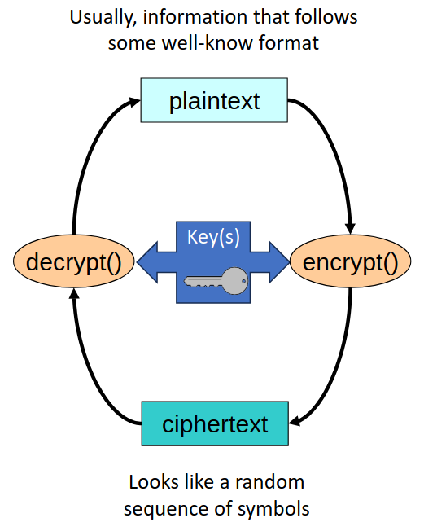

### 1. Select a Cipher
- A **cipher** is a cryptographic algorithm used to transform readable data into an unreadable format.
- Ciphers can be symmetric (using the same key for both encryption and decryption) or asymmetric (using separate public and private keys).

### 2. Apply the Cipher with a Key
- **Key**: A key serves as a parameter in the algorithm, shaping how the encryption is performed.

#### Encryption and Decryption Processes:
   - **Encryption**: Converts original information (**plaintext** or **cleartext**) into a scrambled, unreadable format called a **cryptogram** or **ciphertext**.
   - **Decryption**: Reverses encryption, transforming the cryptogram back to its original, readable form.

### 3. Terminology
- **Plaintext/Cleartext**: The original information before encryption.
- **Ciphertext**: The encrypted, unreadable form of the original data, which requires a key for decryption.

These steps enable cryptography to protect the confidentiality, integrity, and authenticity of sensitive data.

---

## Use Cases for (Symmetric) Ciphers

### Self-Protection with Secret Key K
- **Alice encrypts** plaintext **P** with key **K** ⟶ Alice generates ciphertext **C = {P}k**
- **Alice decrypts** the ciphertext **C** with key **K** ⟶ Alice retrieves plaintext **P' = {C}k**
- **Verification**: **P'** should be equal to the original plaintext **P** (requires verification to ensure accuracy)
- **Key Management**: Only **Alice** needs to know the secret key **K**

### Secure Communication with Secret Key K
- **Alice encrypts** plaintext **P** with key **K** ⟶ Alice generates ciphertext **C = {P}k**
- **Bob decrypts** the ciphertext **C** with key **K** ⟶ Bob retrieves plaintext **P' = {C}k**
- **Verification**: **P'** should be equal to the original plaintext **P** (requires verification to ensure accuracy)
- **Key Management**: Both **Alice** and **Bob** must know and securely manage the secret key **K**

---

## Goals of Cryptanalysis

### Reveal the plaintext hidden in a ciphertext
  - This typically requires discovering the secret key that was used to produce the ciphertext.
  
### Sometimes requires discovering the cipher algorithm
  - In most cases, cryptographic algorithms are public knowledge, allowing their strength to be tested openly. However, there are instances where the algorithm itself is kept secret.
  - **Reverse Engineering**: Occasionally, cryptanalysts may use reverse engineering to deduce the algorithm.
  - **Examples**: Historical and proprietary algorithms such as Lorenz (used in WWII), A5 (for GSM encryption), RC4 (used in WEP encryption), and Crypto-1 (used in Mifare technology).
  - **Digital Rights Management (DRM)**: Some DRM algorithms are also examples of closed or proprietary cryptographic methods.

___

## Cryptanalysis Attacks

### Brute Force
- **Definition**: A brute-force attack is an exhaustive search method that involves systematically trying every possible key in the key space until the correct key is found.
- **Efficiency**: This approach can be computationally expensive and time-consuming, especially for algorithms with large key spaces. Modern Graphics Processing Units (GPUs) are particularly well-suited for this task due to their ability to perform many calculations simultaneously.
- **Key Space**: The key space refers to the complete set of all possible keys for a given cryptographic algorithm. For example, with a 128-bit key, the key space consists of \(2^{128}\) different combinations.
- **Key Randomness**: The effectiveness of a brute-force attack heavily relies on key randomness. A well-designed key should ensure that every possible key has an equal probability of being the correct one. If certain keys are more likely to be used (due to poor randomization or predictable patterns), this can make brute-force attacks more feasible.

### Clever Attacks
- **Definition**: These attacks aim to reduce the key space or search space, thereby increasing the efficiency of the cryptanalysis.
- **Methods**:
  - **Reduced Search Space**: Instead of searching the entire key space, clever attacks may focus on a smaller subset of potential keys. This can involve using common words, predictable numbers, or restricting the key size or alphabet.
  - **Pattern Recognition**: Cryptanalysts may look for identifiable patterns or weaknesses in the cryptographic algorithm's operations. For example, if certain outputs consistently correspond to specific inputs, this can provide clues that help reduce the effective key space.
- **Examples**: Techniques like known plaintext attacks, chosen plaintext attacks, or exploiting weaknesses in the cipher's structure can all be forms of clever attacks that avoid the brute-force approach.

---

## Computer Ciphers

- **Definition**: Computer ciphers are cryptographic algorithms that transform original information into ciphertext through substitution methods.
  
### Substitution Process
- **Basic Operation**: The original information is represented as a sequence of symbols, where each symbol is systematically replaced by a corresponding substitution symbol.
- **Size Consistency**: The substitution typically maintains the same size, ensuring that the transformed sequence retains the original structure.
- **Polyphonic Substitution**: In this method, each original symbol can be replaced with several different, larger substitution symbols, increasing complexity and security.
- **Substitution Alphabet**: Substitution symbols are drawn from a defined substitution alphabet, which can vary in size and structure depending on the cipher used.

### Common Symbol Types
- **Bit**: The smallest unit of data in a computer, representing a binary value (0 or 1).
- **Block of Bits**: A fixed-size group of bits processed as a unit, often used in block ciphers.

### Strategies
- **Monoalphabetic Substitution**: 
  - **Key**: Utilizes a single substitution alphabet that remains consistent throughout the encryption process. Each letter in the plaintext is mapped to a corresponding letter in the ciphertext based on the key.
  - **Example**: A simple Caesar cipher, where each letter is shifted by a fixed number down the alphabet.
  
- **Polyalphabetic Substitution**: 
  - **Key**: Employs multiple substitution alphabets, often changing with each symbol or according to some defined pattern. This increases security by making frequency analysis more challenging.
  - **Example**: The Vigenère cipher, which uses a keyword to determine which alphabet to use for each letter in the plaintext.

Here's a simple example of a substitution cipher using the Caesar cipher method:

### Example of Substitution: Caesar Cipher

1. **Definition of the Caesar Cipher**: 
   - The Caesar cipher is a type of substitution cipher in which each letter of the plaintext is shifted a fixed number of positions down the alphabet.

2. **Choosing the Key**:
   - We will use a shift key of 3.

3. **Original Alphabet**:
   - `A B C D E F G H I J K L M N O P Q R S T U V W X Y Z`

4. **Substituted Alphabet**:
   - `D E F G H I J K L M N O P Q R S T U V W X Y Z A B C`

5. **Plaintext**:
   - "HELLO"

6. **Substitution Process**:
   - **H** → **K**
   - **E** → **H**
   - **L** → **O**
   - **L** → **O**
   - **O** → **R**

7. **Ciphertext**:
   - "KHOOR"

### Summary
In this example, the original text "HELLO" was encrypted to "KHOOR" using a shift of 3 positions. To decrypt, simply apply the reverse shift of 3 to return to the original text.

### Notes
- This method is straightforward and easy to implement, but it is also vulnerable to frequency analysis attacks, especially in longer texts, as the letter frequencies in the ciphertext may reveal information about the original text.

---

## Computer Ciphers: Stream Ciphers

## Overview
- **Definition**: Stream ciphers encrypt or decrypt data by mixing streams, treating the data as a continuous bit stream.
- **Operation**: Each bit of plaintext or ciphertext is XORed (⊕) with a corresponding bit from a keystream.
  
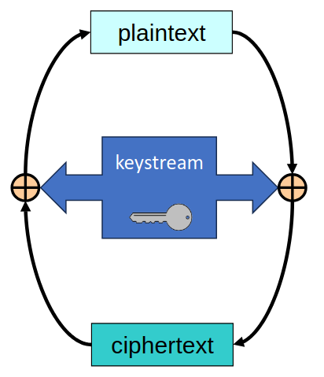

### How Stream Ciphers Work
- **XOR Operation**: The fundamental operation in stream ciphers is the XOR operation, which combines the plaintext bit with the keystream bit:
  - **Encryption**: 
    - \( C = P \oplus K \)
  - **Decryption**: 
    - \( P = C \oplus K \)
- This operation ensures that the same bit of plaintext can be encrypted differently each time, depending on the keystream.

### Key Concepts
- **Bit Stream**: Stream ciphers operate on data as a continuous flow of bits, making them suitable for real-time applications.
- **Keystream**: The keystream is a sequence of bits that is generated, usually randomly, to ensure the security of the encryption. It should be as long as the data being processed to avoid repetition and potential vulnerabilities.

### Polyalphabetic Ciphers
- **Encryption Variability**: In polyalphabetic ciphers, each bit (0 or 1) is not necessarily encrypted the same way, allowing for greater complexity and security.

### Vernam Cipher (One-Time Pad)
- **Perfect Cipher**: The Vernam cipher is theoretically the only perfect cipher, meaning that it can achieve perfect secrecy. However, it is rarely used due to its impracticality.
- **Key Characteristics**: The keystream is produced pseudo-randomly from a limited key and must be as long as the message to maintain its security.

### Ordinary Stream Ciphers
- **Usage**: Stream ciphers are commonly explored in low-level communication protocols, providing efficient encryption for real-time data transmission.

Stream ciphers are essential for securing data in scenarios where speed and efficiency are critical, though they come with their own sets of challenges and considerations in terms of key management and randomness.

---

## Computer Ciphers: Block Ciphers

## Overview
- **Definition**: Block ciphers encrypt or decrypt data in fixed-length blocks of bits, treating sequences of bits as discrete units.
- **Common Size**: Typically, block ciphers use byte blocks (8 bits) as their basic symbols.

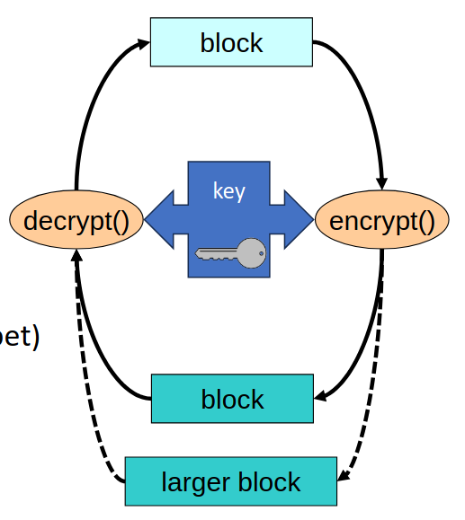

### How Block Ciphers Work
- **Encryption Process**: Each block of plaintext is transformed into a corresponding block of ciphertext based on a defined algorithm and a key.
  - **Transformation**: The transformation process involves substituting each symbol with another symbol as determined by the key.

### Monoalphabetic Ciphers
- **Single Substitution**: Block ciphers are primarily monoalphabetic ciphers, meaning that each block is transformed into another block according to a single substitution alphabet determined by the key.

### Polyalphabetic Characteristics
- **Ciphertext Length**: Some block ciphers may exhibit polyphonic characteristics, where ciphertext blocks are longer than the corresponding plaintext blocks.
- **Randomized Ciphers**: This property is often used in randomized ciphers to enhance security by increasing complexity and unpredictability.

### Advantages of Block Ciphers
- **Security**: Block ciphers are generally more secure than stream ciphers for encrypting larger amounts of data due to their structured approach and fixed transformations.
- **Efficiency**: They can efficiently handle data processing in blocks, making them suitable for various applications, including file encryption and secure data storage.

Block ciphers form a fundamental part of modern cryptographic systems, providing robust mechanisms for ensuring data confidentiality and integrity in a wide range of applications.

---

## Computer Ciphers: Symmetric

## Overview
- **Definition**: Symmetric ciphers are cryptographic algorithms that use the same key for both encryption and decryption processes. 

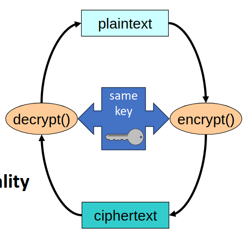

### Key Characteristics
- **Historical Significance**: This is one of the oldest strategies in cryptography, dating back to ancient times.
- **Alternate Name**: They are also known as **secret key ciphers** due to the shared nature of the key.

### Mechanism for Confidentiality
- **Confidentiality**: Symmetric ciphers are the most common mechanism for ensuring data confidentiality. They protect sensitive information by making it unreadable to unauthorized users.
- **Implementation**: 
  - **Simplicity**: They are relatively simple to implement in both software and hardware, making them accessible for various applications.
  - **Performance**: Symmetric ciphers typically offer very good performance, enabling rapid encryption and decryption of data.
  - **Availability**: These ciphers are widely available across different systems and platforms, supporting a broad range of cryptographic applications.

### Common Use Cases
- **Data Protection**: Frequently used for securing sensitive data in storage and during transmission.
- **Network Security**: Commonly employed in protocols like SSL/TLS for secure web communications.

Symmetric ciphers remain a fundamental part of modern cryptography, balancing simplicity, efficiency, and security to meet a wide range of confidentiality needs.

---

## Computer Ciphers: Asymmetric

## Overview
- **Definition**: Asymmetric ciphers are cryptographic algorithms that utilize a pair of keys for encryption and decryption processes, where one key is used for encryption and a different key for decryption.

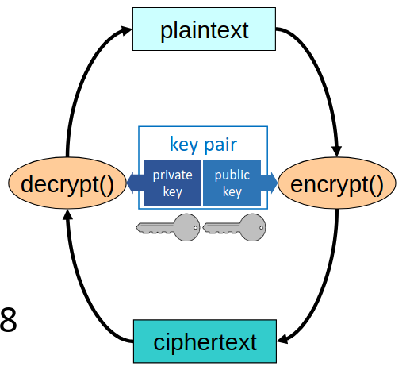

### Key Characteristics
- **Key Pair**: 
  - **Private Component**: This key is kept secret and is known only to the owner. It is used for decrypting information that was encrypted with the corresponding public key.
  - **Public Component**: This key is shared publicly and can be used by anyone to encrypt messages intended for the key's owner. The public key is derived from the private key or secret data.

### Historical Context
- **First Proposal**: The concept of asymmetric cryptography was first proposed in 1978, marking a significant advancement in cryptographic methods.

### Different Algorithms
- **Variety of Algorithms**: Asymmetric ciphers operate using various algorithms that function in unique ways, each with its own advantages and applications. Some well-known asymmetric algorithms include RSA, DSA, and ECC (Elliptic Curve Cryptography).

Asymmetric ciphers play a crucial role in modern security protocols, enabling secure communication, digital signatures, and identity verification without the need to share a secret key. Their unique properties provide an effective solution for various cryptographic challenges.

---

## Computer Ciphers: Combinations

## Overview
- **Definition**: Combinations of cryptographic techniques enhance security by leveraging the strengths of different cipher types, providing robust encryption mechanisms.

### Symmetric Stream Ciphers
- **Polyalphabetic Ciphers**: Stream ciphers can utilize multiple substitution alphabets, which makes them more secure against frequency analysis.
- **Keystream**: The keystream is generated based on the key, and it determines how the plaintext is transformed during encryption.
- **XOR Operation**: The combination of the keystream and the XOR operation implements a polyalphabetic transformation, allowing for dynamic encryption patterns.

### Symmetric Block Ciphers
- **Monoalphabetic Ciphers**: Block ciphers typically operate as monoalphabetic ciphers, transforming blocks of plaintext into ciphertext.
- **Substitution Alphabet**: The substitution alphabet is defined by the algorithm and the key, which determines how each block of bits is encrypted or decrypted.

### Asymmetric (Block) Ciphers
- **Polyphonic Ciphers**: Although asymmetric ciphers are not inherently polyphonic, they can exhibit polyphonic characteristics for enhanced security. This approach allows for multiple ciphertext outputs for the same plaintext input, depending on the keys used.
- **Functionalities**: The functionalities of these ciphers are not homogeneous, as each type serves different purposes and employs various methods to ensure data security.

By combining these various cryptographic techniques, systems can achieve a higher level of security, leveraging the unique properties of each cipher type to address specific vulnerabilities and enhance overall data protection.

---

## Techniques Used by Ciphers

## Overview
- **Definition**: Ciphers employ various techniques to enhance security through complex relationships between plaintext, ciphertext, and keys. Two primary techniques are confusion and diffusion, which work together to protect data.

### Confusion
- **Definition**: Confusion refers to making the relationship between the key, plaintext, and ciphertext as complex as possible.
- **Mechanism**: The output bits (ciphertext) should depend on the input bits (plaintext and key) in a highly intricate manner.
- **Purpose**: By ensuring that the ciphertext is not easily predictable from the plaintext or the key, confusion helps to obscure patterns that could be exploited by cryptanalysts.

### Diffusion
- **Definition**: Diffusion involves spreading the influence of individual plaintext bits throughout the ciphertext.
- **Mechanism**: When one bit of the plaintext is altered, it should cause a significant and unpredictable change in the ciphertext. This characteristic is known as the **avalanche effect**.
- **Purpose**: The goal of diffusion is to dissipate the statistical properties of the plaintext into the ciphertext, making it harder for an attacker to gain any useful information about the plaintext from the ciphertext.

By incorporating confusion and diffusion, ciphers can provide robust security, making it challenging for unauthorized parties to decipher encrypted information. These techniques are fundamental to the design of modern cryptographic algorithms

---

## Symmetric Stream Ciphers: Examples

Stream ciphers are a category of symmetric ciphers that encrypt data one bit or byte at a time, providing a method for secure communication. Here are some notable examples of symmetric stream ciphers:

## A5/1 and A5/2
- **Application**: Used in cellular communications, particularly for securing GSM (Global System for Mobile Communications) voice and data transmissions.
- **Details**: 
  - **A5/1**: Originally designed to provide strong encryption, it employs a 64-bit key but is vulnerable due to design flaws that allow for effective cryptanalysis.
  - **A5/2**: A weaker variant meant for export markets, also uses a 64-bit key with some bits fixed, making it less secure.
- **Significance**: Both ciphers were initially kept secret and were later reverse-engineered, leading to significant security concerns due to their vulnerabilities.

## E0
- **Application**: Utilized in Bluetooth communications to secure data exchanged between devices.
- **Details**: E0 supports key sizes up to 128 bits, providing a more robust security mechanism for wireless connections.
- **Significance**: Its design focuses on efficient encryption for low-power devices, essential in Bluetooth applications.

## RC4
- **Application**: Widely used in Wi-Fi communications, specifically in WEP (Wired Equivalent Privacy), which has been deprecated due to security flaws.
- **Details**: 
  - RC4 is a variable key-size stream cipher that supports key lengths from 40 to 2048 bits, but its initial secrecy led to vulnerabilities when reverse-engineered.
  - Although it was once popular for its speed and simplicity, weaknesses in its key scheduling algorithm have made it obsolete in secure communications.
- **Significance**: The flaws in WEP using RC4 prompted the development of more secure protocols like WPA and WPA2.

## Other Notable Stream Ciphers
- **Salsa20**: A high-speed stream cipher designed for software efficiency, offering a robust security level with a 256-bit key.
- **ChaCha20**: An evolution of Salsa20 that provides improved security and performance, widely used in modern applications, including TLS (Transport Layer Security).

These examples illustrate the evolution and importance of symmetric stream ciphers in securing communication systems, highlighting both their practical applications and the vulnerabilities that have led to the development of more robust alternatives.

---

## Symmetric Stream Ciphers: Approach

Symmetric stream ciphers utilize a specific approach to encrypt and decrypt data by generating a keystream that is combined with the plaintext to produce ciphertext. Here’s how they function:

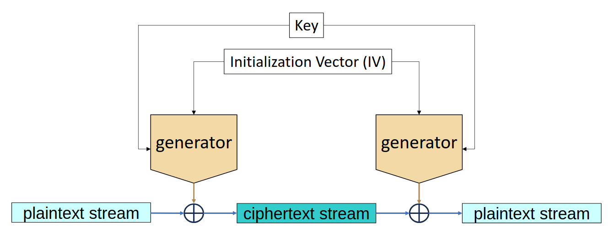

## Key Elements of Stream Ciphers

### Cryptographically Secure, Pseudo-Random Bit Generator
- **Functionality**: At the core of a stream cipher is a cryptographically secure, pseudo-random bit generator (PRBG) that produces the keystream. This generator is essential for ensuring the randomness and unpredictability of the output.
- **State Machine**: The PRBG operates as a state machine, where its internal state changes based on inputs, generating a sequence of bits that appears random.

### Initialization Vector (IV) and Key
- **Initialization Vector**: The IV defines the initial state of the state machine. It ensures that the same plaintext encrypted with the same key on different occasions produces different ciphertexts, adding an extra layer of security.
- **Key**: The key is a secret value that influences how the state machine transitions between states. It plays a crucial role in determining the output of the keystream.

## Characteristics of a Secure Keystream
- **Statistical Randomness**: The keystream generated by a secure PRBG should statistically resemble a truly random sequence of zeros and ones. This means there should be no discernible patterns that attackers could exploit.
- **Resistance to Inference**: If an attacker gains access to a portion of the keystream, they should not be able to deduce:
  - **Past Keystream Values**: Knowledge of the current keystream segment should not provide information about previous bits in the sequence.
  - **Future Keystream Values**: Similarly, it should not allow for predictions about subsequent bits, ensuring that each segment remains independent and secure.

## Overall Process
1. **Key and IV Setup**: The sender and receiver agree on a secret key and an IV.
2. **Keystream Generation**: The PRBG uses the key and IV to produce a keystream.
3. **Encryption**: The plaintext is XORed (⊕) with the keystream to produce ciphertext:
   \[
   \text{Ciphertext} = \text{Plaintext} \oplus \text{Keystream}
   \]
4. **Decryption**: The recipient uses the same keystream (generated from the same key and IV) to recover the plaintext:
   \[
   \text{Plaintext} = \text{Ciphertext} \oplus \text{Keystream}
   \]

By ensuring the security and randomness of the keystream, symmetric stream ciphers can provide effective confidentiality for transmitted data.

---

## Stream Ciphers: Exploitation Considerations

Stream ciphers, while providing effective encryption, have specific vulnerabilities that can be exploited if not managed properly. Below are key considerations for ensuring the security of stream ciphers:

## Avoiding Key and IV Reuse
- **Unique Key and IV for Each Message**: It is critical that no two messages \( P_1 \) and \( P_2 \) are encrypted using the same key and initialization vector (IV).
  
  - **Common Keystream Issue**: If the same key and IV are reused, both messages will be encrypted with the same keystream (\( KS \)):
    \[
    C_1 = P_1 \oplus KS
    \]
    \[
    C_2 = P_2 \oplus KS
    \]

  - **Revealing Information**: An attacker who knows one of the plaintext messages can derive the other plaintext:
    \[
    P_2 = C_2 \oplus KS = C_2 \oplus C_1 \oplus P_1
    \]
  
  - **Impact of Known/Chosen-Plaintext Attacks**: If an attacker gains knowledge of \( P_1 \), they can immediately deduce \( P_2 \). This makes known or chosen-plaintext attacks particularly effective against reused keystreams.

## Keystream Periodicity
- **Periodic Keystreams**: Some keystream generators may produce periodic sequences, meaning the same keystream could be reused if the period is shorter than the amount of data being encrypted.
  
  - **Consequences of Reuse**: If the keystream is reused due to periodicity, it creates the same vulnerabilities as key and IV reuse. This means that patterns can emerge that attackers can exploit, leading to potential plaintext recovery.
  
  - **Length Consideration**: To mitigate this risk, ensure that the plaintext messages are shorter than the length of the keystream’s period. This minimizes the likelihood of keystream repetition.

## Best Practices for Stream Ciphers
1. **Use Unique Key and IV**: Always generate a fresh key and IV for each encryption session.
2. **Monitor Keystream Properties**: Select a high-quality pseudo-random bit generator that minimizes the chances of periodicity and other vulnerabilities.
3. **Regular Key Rotation**: Regularly rotate encryption keys to further diminish the impact of any potential compromises.
4. **Implement Strong Security Protocols**: Use established protocols that incorporate sound cryptographic practices, such as authenticated encryption, to enhance security against various attacks.

By adhering to these considerations, the integrity and confidentiality of data encrypted using stream ciphers can be significantly enhanced.

## Deterministic Manipulation of Ciphertexts
- **Simplicity of Stream Ciphers**: Stream ciphers are designed to be straightforward, where each bit of ciphertext (\( C \)) is generated by directly manipulating a corresponding bit of plaintext (\( P \)). This direct correlation means:
  \[
  C' = C \oplus \Delta \Rightarrow P' = P \oplus \Delta
  \]
  Here, \( \Delta \) represents a change (or manipulation) applied to the ciphertext.

- **Impact of Manipulation**: Because each ciphertext bit depends solely on its corresponding plaintext bit, manipulating the ciphertext will result in an equally predictable change in the plaintext upon decryption. This predictability allows attackers to deliberately alter messages without needing to decrypt them first.

## Necessity of Integrity Control Elements
- **Integrity Controls**: To safeguard against accidental or malicious alterations to the plaintext, it is crucial to implement integrity control mechanisms. These can be applied in two primary ways:
  - **In the Ciphertext**: Adding a checksum or a Message Authentication Code (MAC) to the ciphertext ensures that any unauthorized changes can be detected upon decryption.
  - **In the Plaintext**: Including integrity checks directly in the plaintext allows for verification that the message remains intact after transmission.

- **Objective of Integrity Controls**: The primary goal of these controls is to detect any modifications to the plaintext \( P \), whether they occur accidentally during transmission or maliciously through an attack.

## Best Practices for Maintaining Integrity
1. **Use of Message Authentication Codes (MACs)**: Implement MACs to validate the integrity of ciphertexts before decryption.
2. **Digital Signatures**: Utilize digital signatures to verify both the authenticity and integrity of messages.
3. **Regularly Review Security Protocols**: Ensure that encryption and integrity-checking methods are up-to-date with current security standards to prevent exploitation.
4. **Comprehensive Security Measures**: Employ layered security strategies, including encryption and integrity controls, to provide robust protection against both unauthorized access and data manipulation.

By incorporating integrity controls into the use of stream ciphers, the risks associated with deterministic manipulation of ciphertexts can be effectively mitigated, ensuring both confidentiality and integrity of the data being transmitted.

---

## Symmetric Block Ciphers: Examples

Symmetric block ciphers are widely used in encryption for their efficiency and security. Below are some key examples of symmetric block ciphers, highlighting their features and historical context.

## 1. DES (Data Encryption Standard)
- **Overview**: 
  - Proposed in 1974 and became a federal standard in 1977.
  - Currently deprecated due to vulnerabilities and the advancement of computing power.
- **Specifications**:
  - **Input/Output**: Processes data in 64-bit blocks.
  - **Key Length**: Utilizes a 56-bit key.
- **Usage**: Historically used in various applications but has been largely replaced by more secure algorithms due to its susceptibility to brute-force attacks.

## 2. AES (Advanced Encryption Standard)
- **Overview**: 
  - Proposed in 1998 and adopted as a standard in 2001. The algorithm selected was Rijndael.
  - Currently the most widely used symmetric cipher across various applications.
- **Specifications**:
  - **Input/Output**: Operates on 128-bit blocks.
  - **Key Length**: Supports keys of 128, 192, or 256 bits, allowing for various levels of security.
- **Usage**: Extensively utilized in securing data for government, financial institutions, and various industries worldwide.

## 3. Other Notable Ciphers
- **IDEA (International Data Encryption Algorithm)**: A block cipher that uses a 128-bit key and operates on 64-bit blocks.
- **CAST**: A family of symmetric key block ciphers that support various block sizes and key lengths.
- **Twofish**: A flexible 128-bit block cipher that accepts keys of up to 256 bits.
- **Blowfish**: A fast block cipher that operates on 64-bit blocks and supports variable-length keys.
- **RC5**: A parameterized block cipher that can have variable block sizes (32, 64, or 128 bits) and key sizes up to 2040 bits.
- **RC6**: An enhancement of RC5 with a fixed block size of 128 bits and key sizes from 128 to 256 bits.
- **Kasumi**: Used in mobile communication systems, operating on 64-bit blocks with a 128-bit key.

These examples illustrate the evolution and variety of symmetric block ciphers, emphasizing their importance in modern cryptography for ensuring data confidentiality and integrity.

---

## Symmetric Block Ciphers: Approach

Symmetric block ciphers employ a structured approach to encryption and decryption, ensuring both security and efficiency. Below is an overview of the fundamental principles behind their design.

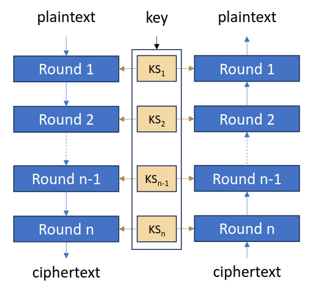

## 1. Pipeline of Transformation Rounds
- **Concept**: 
  - The encryption process involves multiple transformation rounds, each designed to enhance security through a combination of confusion and diffusion.
  - **Confusion** refers to the complexity added to the relationship between the key and the ciphertext, making it harder for attackers to deduce the key from the ciphertext.
  - **Diffusion** ensures that the influence of a single plaintext bit spreads over many ciphertext bits, so changing one bit of plaintext results in significant changes in the output.

## 2. Subkey Control
- **Key Schedule**:
  - Each round of transformation typically employs a subkey derived from the original encryption/decryption key.
  - This process is known as the key schedule, which generates a set of subkeys used in each round to control the transformations.

## 3. Reversibility of Rounds
- **Importance**: 
  - For the decryption process to retrieve the original plaintext, each transformation round must be reversible.
  - This means that the operations performed during encryption must be able to be undone in the decryption phase, ensuring that ciphertext can be accurately transformed back into plaintext.

## 4. Well-Known Structures
- **Feistel Networks**:
  - A common structure in symmetric ciphers where the data block is divided into two halves. The left half is transformed and then XORed with the right half, followed by a swap, creating a round function.
  - This structure allows for efficient encryption and decryption, as the same function can be used for both operations with a simple reversal of the order of rounds.

- **Substitution-Permutation Networks**:
  - These networks use a series of substitution (S-box) and permutation (P-box) operations to obscure the relationship between plaintext and ciphertext.
  - Each round involves substituting input bits with different bits and then permuting their positions to achieve confusion and diffusion. 

This structured approach helps ensure that symmetric block ciphers can effectively secure data against various cryptanalytic attacks while maintaining a manageable level of complexity for implementation.

---

## Feistel Network

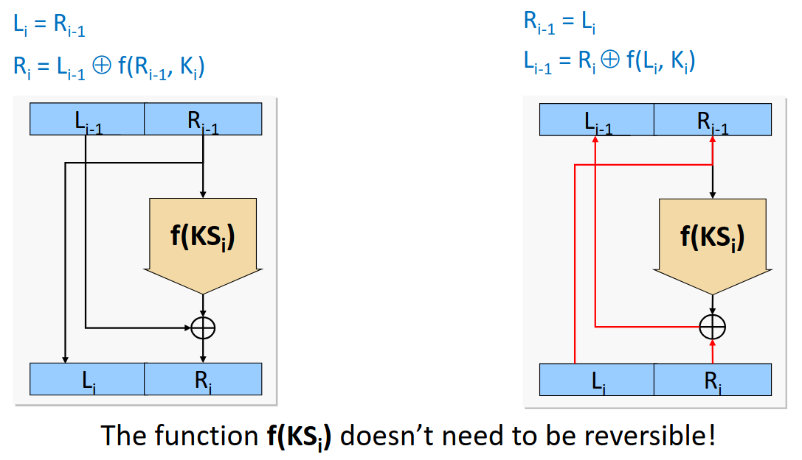

---

## Substitution-Permutation Network

The Substitution-Permutation (SP) network is a fundamental structure used in symmetric block ciphers to provide confusion and diffusion. Below is a detailed overview of its key components and their functions.

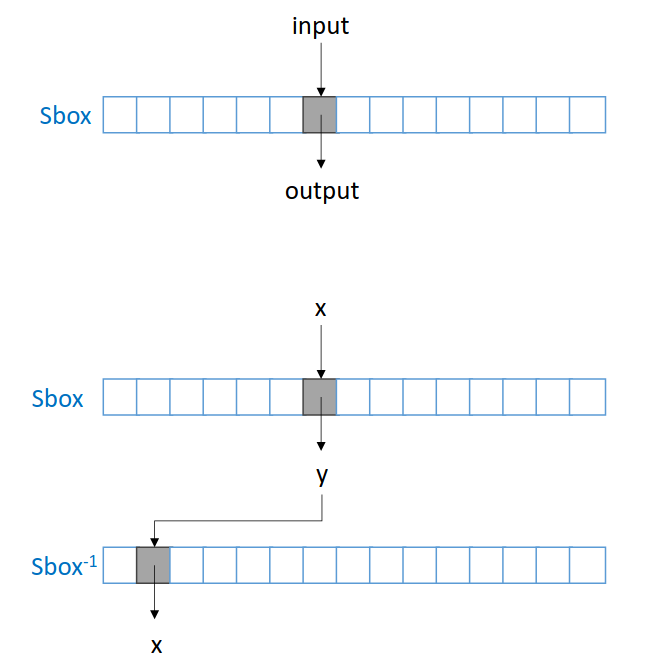

## 1. SBox – Substitution Box
- **Definition**:
  - An SBox is a lookup table that maps each input value (often referred to as an index) to a corresponding output value. The relationship is defined as follows:
    \[
    \text{output} = \text{SBox}[\text{input}]
    \]

- **Types**:
  - **Constant SBoxes**: Used in algorithms like DES (Data Encryption Standard) and AES (Advanced Encryption Standard), where the SBoxes remain fixed regardless of the key.
  - **Key-Dependent SBoxes**: Found in algorithms such as Blowfish and Twofish, where the SBoxes can change based on the encryption key, enhancing security by introducing variability.

- **Reversibility**:
  - SBoxes must be reversible to ensure that the encryption process can be undone during decryption. This is achieved through bijective transformations:
    \[
    y = \text{SBox}[x] \quad \text{and} \quad x = \text{SBox}^{-1}[y]
    \]

## 2. PBox – Permutation Box
- **Definition**:
  - A PBox is responsible for rearranging the positions of input bits without altering their values. It effectively permutes the bits, leading to diffusion within the data.

- **Functionality**:
  - While the bits themselves remain unchanged, the PBox alters their positions, contributing to the overall security of the encryption process by ensuring that the relationship between plaintext and ciphertext is obscured.

### Summary
The combination of SBoxes and PBoxes within the Substitution-Permutation network framework plays a crucial role in the security of symmetric block ciphers. By introducing both substitution (confusion) and permutation (diffusion), these networks create a robust mechanism that enhances resistance against cryptanalytic attacks.

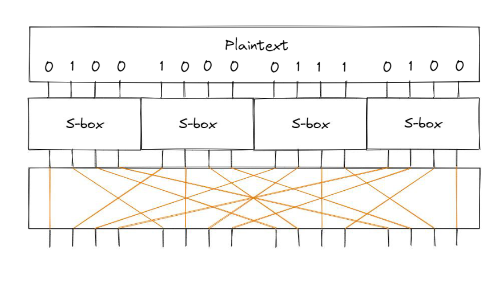

---

## AES Algorithm

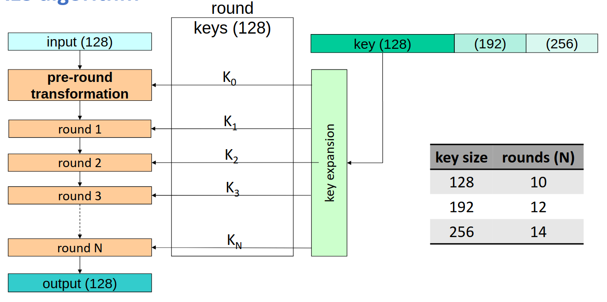

## AES Round

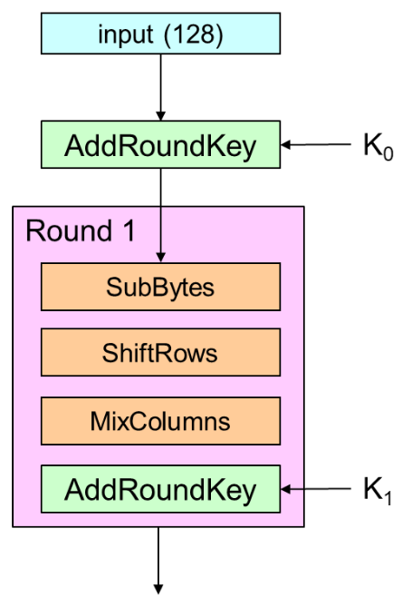

## 1. AddRoundKey
- **Operation**:
  - This step involves a **128-bit XOR** operation between the input data and a round key.
  
- **Output**:
  - The result of the AddRoundKey step is represented as a **4x4 byte matrix**. This matrix structure is essential for subsequent transformations in the AES algorithm.

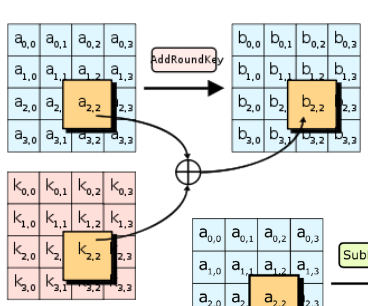

## 2. SubBytes
- **Functionality**:
  - In this step, each byte of the 4x4 matrix is substituted using a **256-element S-box**.
  
- **Process**:
  - The S-box provides a non-linear transformation, which enhances the confusion in the encryption process by ensuring that similar plaintext bytes do not yield similar ciphertext bytes.

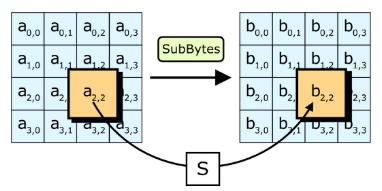

## 3. ShiftRows
- **Operation**:
  - This transformation involves **rotating each row** of the matrix to the left by a specific number of bytes.
  
- **Byte Shifts**:
  - The amount of left rotation varies for each row:
    - Row 0: **0** bytes (no shift)
    - Row 1: **1** byte
    - Row 2: **2** bytes
    - Row 3: **3** bytes

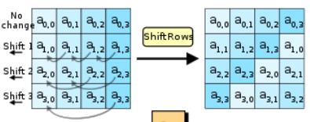

## 4. MixColumns
- **Functionality**:
  - Each column of the matrix undergoes a transformation that combines the bytes within that column.
  
- **Process**:
  - The MixColumns step enhances diffusion by mixing the data in each column, ensuring that changes in the input lead to significant changes in the output.
  
- **Note**:
  - This transformation is **not performed in the last round** of AES encryption. This approach is designed to simplify the decryption process while maintaining security throughout the earlier rounds.

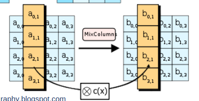

---

## AES in CPU Instruction Sets

AES (Advanced Encryption Standard) has been optimized in modern CPU architectures to enhance performance and security. Several instruction sets have been introduced to facilitate efficient AES encryption and decryption. Below are notable examples:

## 1. Intel AES New Instructions (AES-NI)

|                 |                                                  |
|-----------------|--------------------------------------------------|
| AESENC          | Perform one round of an AES encryption flow      |
| AESENCLAST      | Perform the last round of an AES encryption flow |
| AESDEC          | Perform one round of an AES decryption flow      |
| AESDECLAST      | Perform the last round of an AES decryption flow |
| AESKEYGENASSIST | Assist in AES round key generation               |
| AESIMC          | Assist in AES Inverse Mix Columns                |

- **Overview**: 
  - AES-NI is a set of instructions that enable fast and secure AES encryption and decryption directly in the CPU. This hardware acceleration helps improve the performance of applications that utilize AES, particularly in scenarios involving large volumes of data.

- **Key Features**:
  - Provides specific instructions for each of the main steps in the AES algorithm, such as key expansion, encryption rounds, and decryption rounds.
  - Reduces the number of clock cycles needed to perform AES operations, thus significantly speeding up cryptographic operations.

- **Implementation**:
  - Many software libraries, such as OpenSSL, leverage AES-NI to enhance their cryptographic performance automatically, benefiting from the underlying hardware capabilities without needing extensive code modifications.

## 2. ARMv8 Cryptographic Extension
- **Overview**:
  - The ARMv8 architecture includes a set of cryptographic extensions that provide hardware acceleration for various cryptographic algorithms, including AES. This feature is especially useful for mobile and embedded devices, where efficient power consumption is crucial.

- **Key Features**:
  - Offers specific instructions for performing AES encryption and decryption, similar to Intel's AES-NI.
  - Improves the performance of cryptographic operations while reducing power consumption, making it suitable for battery-operated devices.

- **Implementation**:
  - Software applications targeting ARM-based devices can take advantage of these cryptographic extensions to accelerate AES operations, resulting in faster data processing and enhanced security features.

## 3. Other Architectures
- **Additional Extensions**:
  - Other CPU architectures and instruction sets, such as those from AMD and various RISC architectures, also provide similar support for AES through dedicated instructions, enhancing the performance of AES operations across different platforms.

- **Future Developments**:
  - As cryptographic needs evolve, further enhancements in CPU instruction sets to support AES and other cryptographic algorithms are anticipated, including improvements in security measures against emerging threats.

---

## Cipher Modes: Electronic Code Book (ECB)

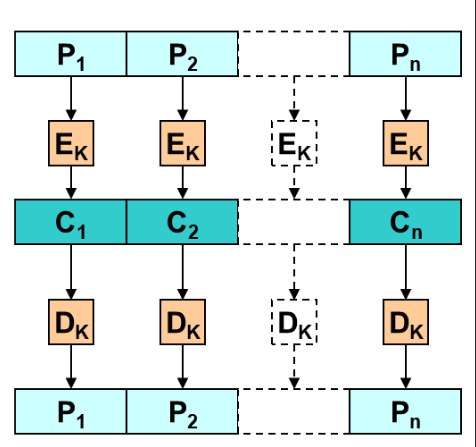

### 1. Overview of ECB Mode

- **Encryption Process**:
  - Encrypts each block of plaintext independently.
  - Formula: \( C_i = E_K(P_i) \)
  
- **Decryption Process**:
  - Decrypts each block of ciphertext independently.
  - Formula: \( P_i = D_K(C_i) \)
  
- **Parallel Processing**:
  - ECB allows for each block to be processed independently, enabling high levels of parallelism in encryption and decryption.
  
- **Random Access**:
  - Enables access to specific blocks directly, making it possible to decrypt particular parts of data without needing the entire ciphertext.

### 2. Problem with ECB Mode

- **Pattern Exposure**:
  - ECB is vulnerable to pattern exposure. Identical blocks of plaintext will produce identical blocks of ciphertext.
  - For example, if \( P_i = P_j \), then \( C_i = C_j \), making any repeated patterns in the plaintext apparent in the ciphertext.
  
- **Security Implications**:
  - This predictability makes ECB unsuitable for sensitive data, as it can expose structural information about the plaintext, especially if it has repetitive content.

---

## Cipher Modes: Cipher Block Chaining (CBC)

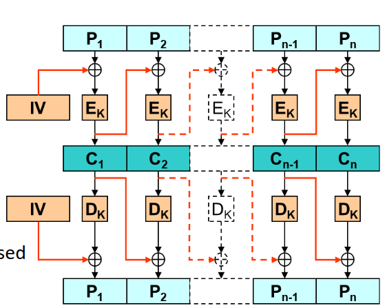

### 1. Overview of CBC Mode

- **Encryption Process**:
  - Each plaintext block is XORed with the previous ciphertext block before being encrypted.
  - Formula: \( C_i = E_K(P_i \oplus C_{i-1}) \)
  
- **Decryption Process**:
  - Each ciphertext block is decrypted and then XORed with the previous ciphertext block to obtain the plaintext.
  - Formula: \( P_i = D_K(C_i) \oplus C_{i-1} \)

- **First Block Initialization**:
  - The first block uses an Initialization Vector (IV) instead of a previous ciphertext block.
  - The IV ensures the encryption is unique each time, even for identical plaintext inputs.

### 2. IV (Initialization Vector)

- **Purpose**:
  - Prevents identical plaintext blocks from producing identical ciphertext blocks by introducing randomness.
  
- **IV Properties**:
  - **Randomness**: Ideally, the IV should be a random or sequence value.
  - **Reusability**: Should not be reused with the same key to maintain security.
  - **Transmission**: The IV can be sent openly as it is not considered secret.

### 3. Polyalphabetic Transformation in CBC

- **Feedback Mechanism**:
  - CBC uses a feedback loop where each block influences the encryption of the next, preventing repetitive patterns.
  
- **Effectiveness**:
  - This approach makes it appear as if each block has a different key, adding a layer of complexity to the ciphertext and enhancing security by mitigating pattern exposure.

---

## ECB vs CBC: Pattern Exposure

### 1. Pattern Exposure in ECB Mode

In **Electronic Code Book (ECB)** mode, each data block is processed independently. This approach enables parallel encryption and random access to blocks but has a major drawback: **pattern exposure**. If two original data blocks (plaintext) are identical, the resulting encrypted blocks (ciphertext) will also be identical, revealing patterns and making ECB unsuitable for data with repetitive structures.

*Example image of ECB showing visible patterns when repetitive data is encrypted.*

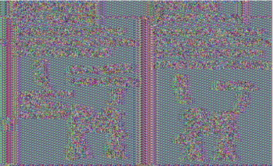

### 2. Pattern Exposure in CBC Mode

In **Cipher Block Chaining (CBC)** mode, each plaintext block is combined with the previous ciphertext block using an XOR operation before encryption. This feedback method hides patterns and makes CBC much more secure for data with repetitions. The first block uses an Initialization Vector (IV), which prevents identical plaintext blocks from producing identical ciphertext blocks, even when encrypting the same plaintext multiple times.

*Example image of CBC showing the absence of visible patterns due to block chaining, which conceals repetitions.*

---

## ECB/CBC Cipher Modes: Handling Non-Block-Aligned Data

### 1. Block Alignment Requirement

**Electronic Code Book (ECB)** and **Cipher Block Chaining (CBC)** modes both require that input data be **block-aligned**. This means the size of the data must be a multiple of the cipher’s block size (e.g., 128 bits for AES). When the data does not perfectly fit into the block size, **special treatment** of the final block is necessary.

### 2. Solutions for Non-Block-Aligned Data

There are several techniques to handle data that doesn’t align perfectly with the block size:

- **Padding**: The most common approach, which involves adding extra data to the final block to fill the space to match the block size. The padding is designed to be identifiable and removable after decryption.
- **Different Processing for Sub-Blocks**: This technique involves a distinct handling of the last sub-block if it is incomplete. However, it adds complexity to the encryption process and is rarely used in practice.

### 3. PKCS #7 Padding

**PKCS #7 padding** is a widely used padding scheme for block ciphers, allowing blocks to be aligned by appending specific bytes to the final block.

- **Padding Process**:
  - Calculate the padding needed: `X = B – (M mod B)`, where `B` is the block size, and `M` is the length of the message.
  - Add `X` bytes, each with a value of `X`, to the end of the data.
  
- **PKCS #5** is a variant of PKCS #7 with a fixed block size of 8 bytes.

**Drawback**: If the data is already perfectly aligned, an extra padding block is still added, as padding must always be identifiable for removal. 

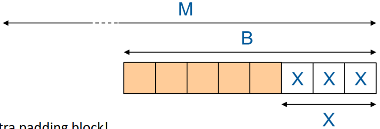

---

## Stream Cipher Modes

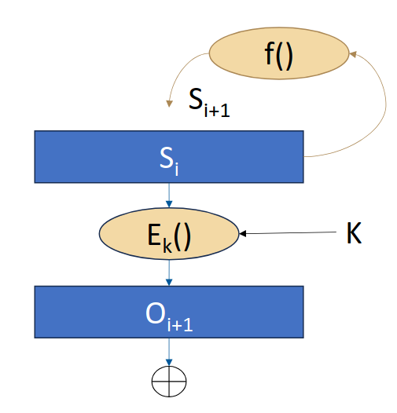

Stream cipher modes utilize **pseudorandom generators** to produce a keystream, enabling them to encrypt data bit-by-bit or byte-by-byte. Various techniques can be used to implement these generators, some of which are optimized for hardware, making them ideal for **mobile, battery-powered devices**. Other techniques are more suitable for **CPU-based implementations**.

### 1. Key Characteristics

- Stream ciphers typically employ a **pseudorandom generator** to create the keystream.
- Some techniques are optimized for **hardware efficiency** and are commonly used in **low-power devices**.
- Other implementations are optimized for **CPU processing** on computers or servers.

### 2. Stream Cipher Modes Using Block Ciphers

In some stream cipher modes, a **block cipher** (e.g., AES) is used to create the stream cipher's pseudorandom generator, following these key principles:

- The generator functions as a **state machine**, producing a keystream one iteration at a time:
  - **State Machine**: At each iteration \(i\), the state \(S_i\) defines the generator’s behavior.
  - **Output Generation**: The generator produces output \(O_{i+1} = E_K(S_i)\), where \(E_K\) represents the block cipher encryption using a key \(K\).
  - **State Update**: After generating \(O_{i+1}\), the state \(S_i\) is updated to \(S_{i+1}\) using a **transformation function** \(f\).
  - **Initialization Vector (IV)**: The initial state \(S_0\) is set by an **IV**, ensuring each keystream is unique.

- This approach relies exclusively on **block cipher encryptions (or decryptions)** to produce a pseudorandom keystream for data encryption. 

By leveraging these principles, stream cipher modes can benefit from the **security properties of block ciphers** while efficiently encrypting data streams.

---

## Stream Cipher Mode: n-bit OFB (Output Feedback)

The **Output Feedback (OFB)** mode is a stream cipher mode that transforms a block cipher into a stream cipher by feeding the encrypted output back into the state. This allows for the encryption of variable-length messages without repeating the keystream, which increases security.

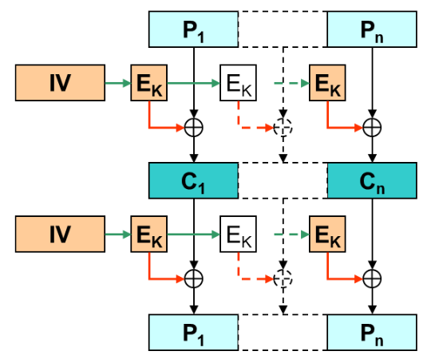
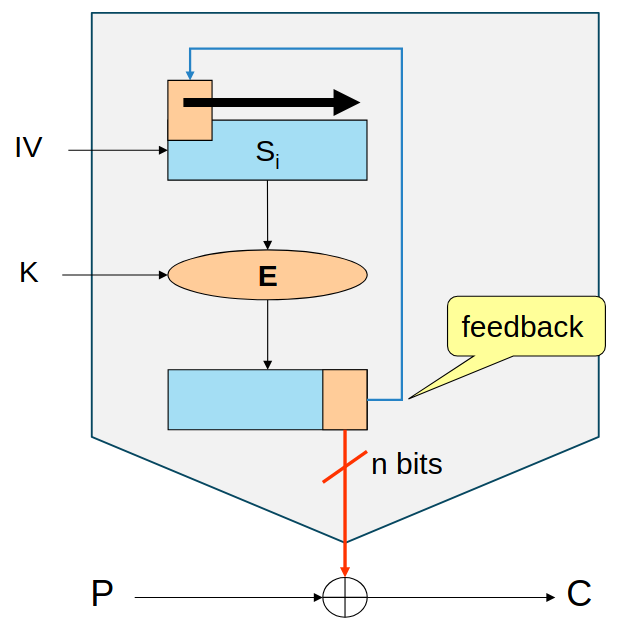

### 1. Encryption Process

In OFB mode, each plaintext block \( T_i \) is XORed with the encrypted output of the previous state to produce the ciphertext block \( C_i \):

- **Ciphertext Generation**:
  \[
  C_i = T_i \oplus E_K(S_{i-1})
  \]
  where:
  - \( T_i \) is the plaintext block at step \( i \)
  - \( C_i \) is the resulting ciphertext block
  - \( E_K(S_{i-1}) \) is the encrypted state output

### 2. Decryption Process

Decryption is similar to encryption but in reverse. Each ciphertext block \( C_i \) is XORed with the encrypted output of the previous state to recover the plaintext block \( T_i \):

- **Plaintext Recovery**:
  \[
  T_i = C_i \oplus E_K(S_{i-1})
  \]

### 3. State Update

The state \( S \) is updated in each iteration based on a transformation function \( f \), which usually reuses the encrypted output from the previous state to avoid pattern repetition:

- **State Transition**:
  \[
  S_{i+1} = f(S_i, E_K(S_i))
  \]

The initial state \( S_0 \) is determined by the **Initialization Vector (IV)**, ensuring unique keystreams for each encryption session with the same key.

### 4. Key Characteristics

- **Feedback Loop**: By feeding back the encrypted output, OFB creates a continuous keystream, enabling the cipher to function like a stream cipher.
- **Synchronization**: Since OFB is sensitive to synchronization errors, missing or extra bits in the ciphertext can lead to incorrect decryption for all subsequent blocks.
- **Error Propagation**: In OFB, errors are limited to the affected block, making it more resilient to bit errors compared to other modes, like Cipher Block Chaining (CBC).

OFB mode is commonly used when **data integrity** is handled separately since it lacks intrinsic error detection capabilities. It is well-suited for scenarios requiring **stream encryption**, like real-time communications and file encryption.

---

## Stream Cipher Mode: n-bit CFB (Ciphertext Feedback)

The **Ciphertext Feedback (CFB)** mode is a stream cipher mode that transforms a block cipher into a stream cipher by incorporating the ciphertext from the previous block into the state for the next encryption operation. This feedback mechanism provides a continuous keystream and ensures that each ciphertext block influences the subsequent block, enhancing security.

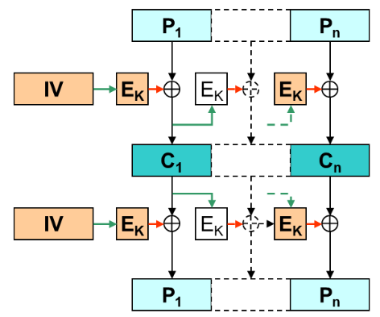
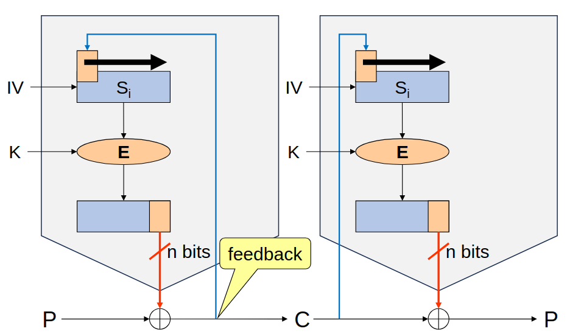

### 1. Encryption Process

In CFB mode, each plaintext block \( T_i \) is XORed with the encrypted state of the previous iteration to generate the ciphertext block \( C_i \):

- **Ciphertext Generation**:
  \[
  C_i = T_i \oplus E_K(S_{i-1})
  \]
  where:
  - \( T_i \) is the plaintext block at step \( i \)
  - \( C_i \) is the ciphertext block produced
  - \( E_K(S_{i-1}) \) represents the encrypted state output from the previous step

### 2. Decryption Process

During decryption, the ciphertext block \( C_i \) is XORed with the encrypted output of the previous state to retrieve the original plaintext block \( T_i \):

- **Plaintext Recovery**:
  \[
  T_i = C_i \oplus E_K(S_{i-1})
  \]

### 3. State Update

The state \( S \) is updated in each iteration by feeding back the current ciphertext block \( C_i \) rather than the plaintext, which impacts the encryption process in future blocks:

- **State Transition**:
  \[
  S_{i+1} = f(S_i, C_i)
  \]

The initial state \( S_0 \) is defined by an **Initialization Vector (IV)**, providing a unique starting point for each encryption session using the same key.

### 4. Key Characteristics

- **Feedback Mechanism**: By feeding back the ciphertext, CFB mode ensures that each encryption operation depends on all prior ciphertext blocks, adding security through dependency.
- **Error Propagation**: In CFB, an error in one ciphertext block will propagate into the decryption of subsequent blocks, potentially affecting only a limited number of blocks.
- **Stream Cipher Emulation**: Like OFB, CFB can handle variable-length messages, making it suitable for stream encryption applications.

CFB is a versatile mode used in applications like **real-time data encryption** and **network security protocols** where a stream-like approach is needed. It is particularly useful when **error propagation** is acceptable, or errors are rare.

---

## Cipher Mode: n-bit CTR (Counter Mode)

The **Counter (CTR) mode** is a versatile cipher mode that transforms a block cipher into a stream cipher using a unique counter for each block encryption. CTR mode is efficient, highly parallelizable, and widely used in applications where high-speed encryption and decryption are essential.

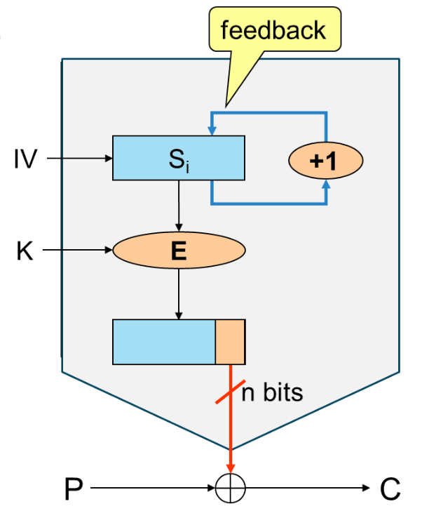

### 1. Encryption Process

In CTR mode, each plaintext block \( T_i \) is XORed with the encrypted counter value to generate the ciphertext block \( C_i \):

- **Ciphertext Generation**:
  \[
  C_i = T_i \oplus E_K(S_{i-1})
  \]
  where:
  - \( T_i \) is the plaintext block at step \( i \)
  - \( C_i \) is the resulting ciphertext block
  - \( E_K(S_{i-1}) \) represents the encrypted counter value at step \( i - 1 \)

### 2. Decryption Process

During decryption, the ciphertext block \( C_i \) is XORed with the same encrypted counter value to retrieve the original plaintext block \( T_i \):

- **Plaintext Recovery**:
  \[
  T_i = C_i \oplus E_K(S_{i-1})
  \]

### 3. Counter Update

In CTR mode, the state \( S \) serves as a counter and is incremented with each encryption operation:

- **Counter Transition**:
  \[
  S_{i+1} = S_i + 1
  \]

The initial counter value \( S_0 \) is set by an **Initialization Vector (IV)**, which should be unique for each session to ensure encryption security across repeated messages using the same key.

### 4. Key Characteristics

- **Parallelizable**: Unlike CBC and CFB modes, CTR mode allows parallel encryption and decryption of blocks, making it suitable for high-performance applications.
- **Uniform Random Access**: Each block can be encrypted or decrypted independently, providing efficient random access to encrypted data.
- **Error Handling**: Errors in a single ciphertext block do not affect other blocks, limiting error propagation.
- **Stream Cipher Emulation**: Like other stream cipher modes, CTR can handle messages of arbitrary lengths, ideal for encrypting large datasets.

CTR mode is commonly used in scenarios requiring high throughput, such as **disk encryption**, **network encryption**, and **real-time applications**. It’s particularly advantageous in situations where **parallel processing** and **random access** are needed.

---

## Stream Cipher Mode: Galois/Counter Mode (GCM)

**Galois/Counter Mode (GCM)** is an authenticated encryption mode that combines the Counter mode of operation with Galois field multiplication to provide both confidentiality and data integrity. It is widely used in various security protocols, including TLS and IPsec, due to its efficiency and strong security properties.

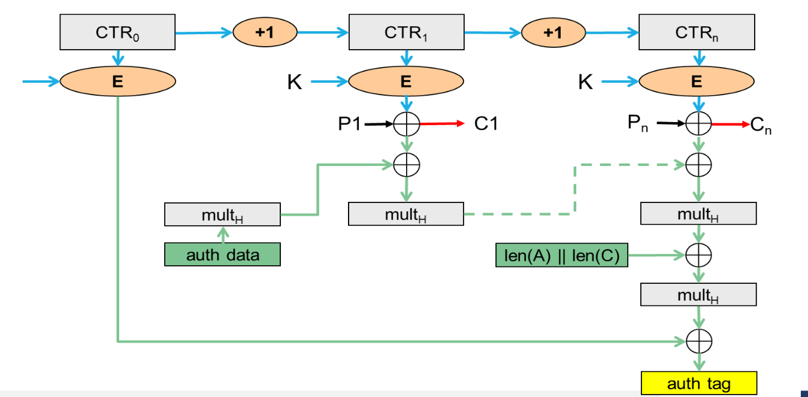

### 1. Overview

GCM mode is designed to offer:
- **Confidentiality**: Ensures that plaintext remains secret from unauthorized parties.
- **Integrity**: Provides a means to verify that the data has not been altered in transit.

### 2. Components

GCM consists of two main components:
1. **Encryption Component**: Utilizes a block cipher (typically AES) in Counter mode to encrypt the plaintext.
2. **Authentication Component**: Employs Galois field multiplication to create an authentication tag, ensuring data integrity.

### 3. Encryption Process

The encryption in GCM mode involves the following steps:

- **Initialization**:
  - Start with an Initialization Vector (IV), which should be unique for each encryption session.

- **Counter Mode Encryption**:
  - For each plaintext block \( T_i \):
  \[
  C_i = T_i \oplus E_K(S_{i-1})
  \]
  where \( E_K(S_{i-1}) \) is the encrypted counter value.

- **Counter Update**:
  - Update the counter for the next block:
  \[
  S_{i+1} = S_i + 1
  \]

### 4. Authentication Tag Generation

In addition to encryption, GCM generates an authentication tag that validates the integrity of both the ciphertext and additional authenticated data (AAD). The tag is produced as follows:

- **Compute Hash**:
  - GCM uses Galois field multiplication to compute a hash of the ciphertext and AAD:
  \[
  H = E_K(0)
  \]
  - This represents the hash of zero and is used in further calculations.

- **Tag Calculation**:
  - The final authentication tag \( \text{Tag} \) is computed using the Galois field multiplication and XOR:
  \[
  \text{Tag} = (H \times C) \oplus \text{len}(AAD) \oplus \text{len}(C)
  \]

### 5. Decryption Process

Decryption in GCM mode follows a similar process to encryption, with an additional step to verify the authenticity of the ciphertext:

- **Decrypt Ciphertext**:
  \[
  T_i = C_i \oplus E_K(S_{i-1})
  \]

- **Verify Authentication Tag**:
  - The receiver calculates the expected tag from the received ciphertext and AAD and compares it with the received tag. If they match, the data is considered authentic; otherwise, it indicates tampering.

### 6. Key Characteristics

- **Efficiency**: GCM is designed to be efficient in both hardware and software implementations, making it suitable for high-speed applications.
- **Parallel Processing**: Both encryption and authentication operations can be performed in parallel, improving performance.
- **Widely Adopted**: GCM is widely used in secure communications protocols, providing both encryption and integrity verification in a single operation.

Galois/Counter Mode is a robust choice for applications requiring high-performance encryption with strong integrity guarantees, such as in secure network communications and data-at-rest encryption.

---

## Cipher Modes: Comparison

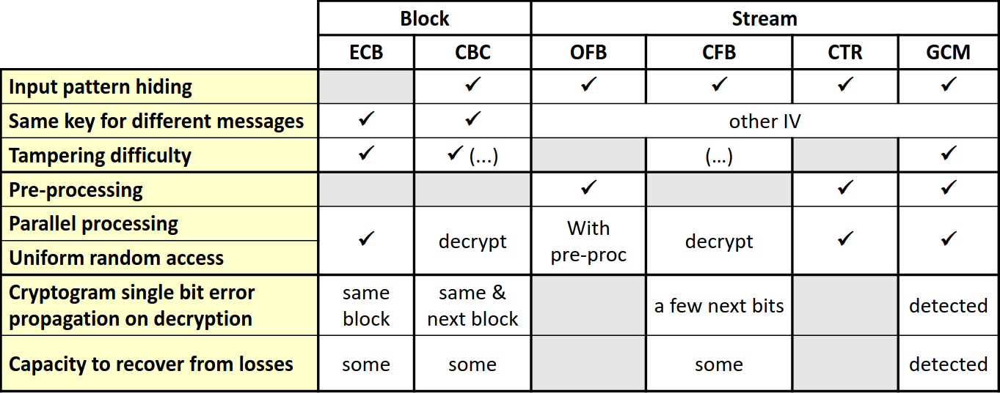

---

## Cipher Modes: Multiple Encryption

**Multiple encryption techniques** were developed to enhance the security of cryptographic algorithms, particularly to prolong the effective lifetime of older standards like DES (Data Encryption Standard). These techniques aim to address the vulnerabilities associated with short key lengths and advances in cryptanalysis.

### 1. Background on DES

- **DES Overview**:
  - DES was a widely used symmetric key encryption standard established in the 1970s. 
  - It employs a 56-bit key for encryption and decryption operations.

- **Security Concerns**:
  - Despite DES not being cryptanalyzed during its early adoption, the 56-bit key was soon found to be susceptible to brute force attacks, as computational power increased.
  - The need for stronger encryption methods became evident, leading to the development of multiple encryption schemes.

### 2. Triple DES (3DES-EDE)

Triple DES, also known as EDE (Encrypt-Decrypt-Encrypt), is a method that enhances the security of DES by applying the encryption process multiple times using different keys.

#### Encryption Process

The encryption operation for Triple DES can be represented as:
\[
C_i = E_{K_3}(D_{K_2}(E_{K_1}(P_i)))
\]

- **Key Usage**:
  - **K1, K2, and K3** are three different keys, providing flexibility in key management.
  
#### Decryption Process

The corresponding decryption operation is:
\[
P_i = D_{K_1}(E_{K_2}(D_{K_3}(C_i)))
\]

### 3. Key Lengths and Security Levels

- **Key Length Variations**:
  - When all three keys are different (K1 ≠ K2 ≠ K3), 3DES uses a **168-bit key**.
  - If two keys are the same (K1 = K3 ≠ K2), it effectively uses a **112-bit key**.
  - In the case where all three keys are identical (K1 = K2 = K3), it reverts to simple DES encryption.

### 4. Performance Considerations

- **Speed**:
  - While 3DES provides enhanced security, it operates at a speed approximately **three times slower than standard DES**, as it performs multiple encryption and decryption operations.
- **Cryptographic Strength**:
  - Despite its speed disadvantage, the increased key length significantly improves security against brute force attacks, making it a suitable option for applications requiring stronger encryption.

### 5. Conclusion

Multiple encryption methods, particularly Triple DES, play a crucial role in extending the viability of older cryptographic algorithms like DES. While it introduces complexities and performance penalties, the security benefits of using longer keys and multiple rounds of encryption have made it a valuable tool in the arsenal of cryptographic techniques, especially during the transition to newer standards such as AES (Advanced Encryption Standard).

---

## Cipher Modes: DESX

**DESX** is a cryptographic enhancement designed to improve the security and performance of the original DES (Data Encryption Standard). By utilizing additional keys and a modified encryption process, DESX offers a faster alternative to Triple DES while extending the effective key length.

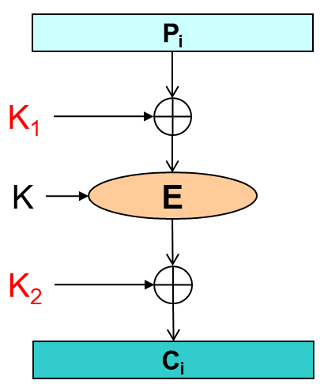

### 1. Overview of DESX

- **Purpose**: 
  - DESX was developed to prolong the lifespan of DES by addressing its vulnerabilities without the performance drawbacks of Triple DES (3DES).

- **Performance**: 
  - DESX operates significantly faster than 3DES, making it more suitable for applications requiring efficient encryption while still benefiting from increased security.

### 2. Key Structure and Usage

- **Key Components**:
  - **K1**: First additional key used before the main DES encryption.
  - **K2**: Second additional key used after the main DES encryption.
  - The original DES key remains at 56 bits.

#### Encryption Process

The encryption operation in DESX is expressed as follows:
\[
C_i = E_{K}(K_1 \oplus P_i) \oplus K_2
\]

- **Explanation**:
  - The plaintext \(P_i\) is first combined with the key \(K_1\) using the XOR operation.
  - The result is then encrypted using the standard DES algorithm with the DES key \(K\).
  - Finally, the output is XORed with the second key \(K_2\) to produce the ciphertext \(C_i\).

#### Decryption Process

The decryption operation can be represented as:
\[
P_i = K_1 \oplus D_{K}(K_2 \oplus C_i)
\]

- **Explanation**:
  - The ciphertext \(C_i\) is first combined with \(K_2\) through XOR.
  - The result is decrypted using the DES decryption function.
  - The plaintext \(P_i\) is retrieved by XORing the decrypted output with \(K_1\).

### 3. Effective Key Length

- **Key Length Calculation**:
  - The effective key length of DESX is calculated as follows:
  \[
  64 \text{ (K1)} + 64 \text{ (K2)} + 56 \text{ (DES Key)} = 184 \text{ bits}
  \]

- **Security Improvement**:
  - The combined key length of 184 bits provides enhanced security compared to both standard DES and 3DES, which offers only up to 168 bits.

### 4. Conclusion

DESX serves as an effective bridge between the legacy DES standard and more modern encryption methods. By adding confusion through the use of additional keys and maintaining a faster processing speed, DESX provides a practical solution for applications needing strong security without sacrificing performance. Its improved key length further fortifies it against potential brute-force attacks, making it a valuable option in scenarios where DES might still be in use.